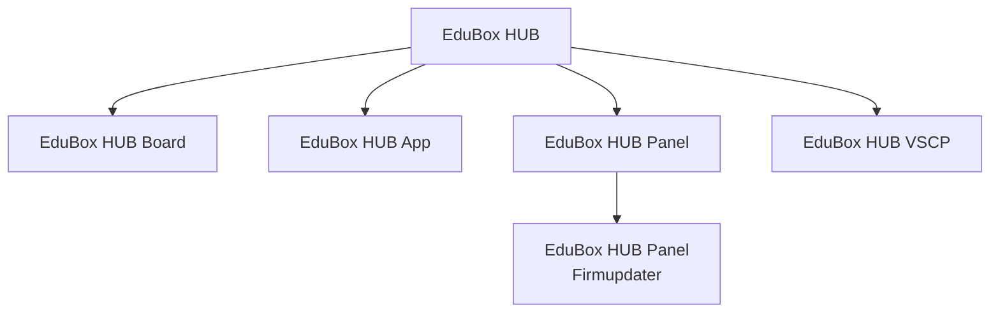

# EduBox HUB


**EduBox HUB** je hlavní vstupní bod a zastřešující repozitář ekosystému pro
práci se senzory, aktuátory a virtuálními zařízeními. Zdrojové projekty jsou
připojeny jako Git submoduly, takže tento repozitář uchovává jejich vzájemně
kompatibilní revize pomocí gitlinků.

## Hierarchie



| Součást | Role | Repozitář |
| --- | --- | --- |
| **EduBox HUB Board** | Firmware centrální jednotky pro senzory a aktuátory | [EduBox-HUB-Board](https://github.com/sgtkingo/EduBox-HUB-Board) |
| **EduBox HUB App** | Desktopová aplikace pro Windows | [EduBox-HUB-App](https://github.com/sgtkingo/EduBox-HUB-App) |
| **EduBox HUB Panel** | Dotykové HMI pro vizualizaci a ovládání | [EduBox-HUB-Panel](https://github.com/sgtkingo/EduBox-HUB-Panel) |
| **EduBox HUB Panel Firmupdater** | Webový nástroj pro aktualizaci firmwaru Panelu | [EduBox-HUB-Panel-Firmupdater](https://github.com/sgtkingo/EduBox-HUB-Panel-Firmupdater) |
| **EduBox HUB VSCP** | Sdílený komunikační protokol a knihovna | [EduBox-HUB-VSCP](https://github.com/sgtkingo/EduBox-HUB-VSCP) |

Firmupdater je logicky součástí větve Panel. V kořeni superprojektu má vlastní
nepřekrývající se cestu, protože adresář `EduBox-HUB-Panel` je sám gitlink.

## Získání celého ekosystému

```bash
git clone --recurse-submodules https://github.com/sgtkingo/EduBox-HUB.git
cd EduBox-HUB
```

Pokud už je repozitář naklonovaný bez submodulů:

```bash
git submodule update --init --recursive
```

Aktualizace všech submodulů na sledovanou větev `main`:

```bash
git submodule update --remote --recursive
```

Po ověření kompatibility je potřeba nově zvolené revize submodulů zapsat
commitem v tomto hlavním repozitáři.

## Názvosloví

- zastřešující značka a superprojekt: **EduBox HUB**;
- centrální deska a její firmware: **EduBox HUB Board**;
- hlavní softwarové větve: **EduBox HUB App**, **EduBox HUB Panel** a
  **EduBox HUB VSCP**;
- aktualizační nástroj Panelu: **EduBox HUB Panel Firmupdater**, zkráceně
  **Firmupdater**, pokud je jeho zařazení zřejmé.
